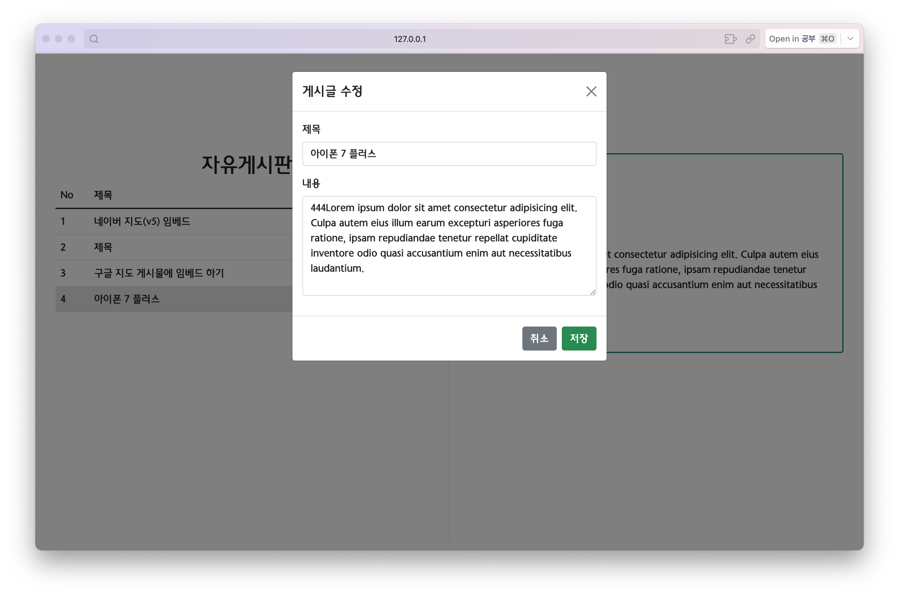
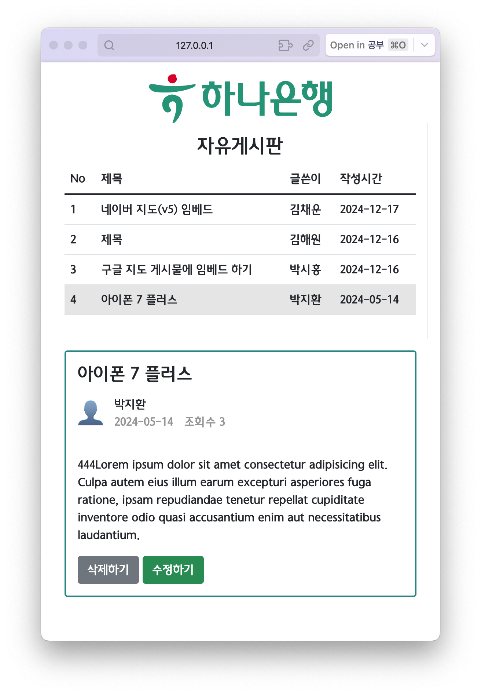

# hanaro-web
### login
1. html/css
   1. 부트스트랩을 이용한 컴포넌트 사용 (버튼)
   2. 상업에서 많이 사용할만한 디자인 차용
화면 예시

### board

1. html/css
   1. 부트스트랩을 이용한 템플릿 사용 (테이블, 모달, 버튼)
   2. grid를 이용한 반응형 페이지 적용
2. js
   1. CRUD 중 RUD 구현

화면 예시

